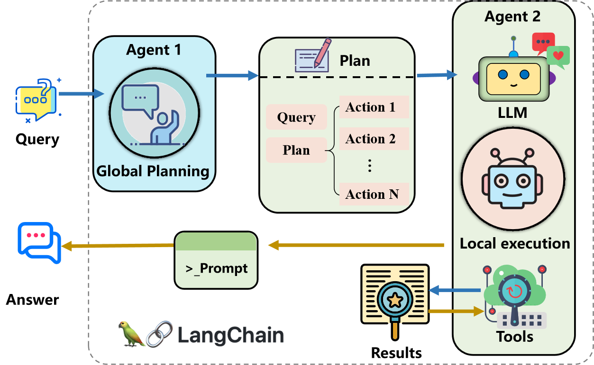
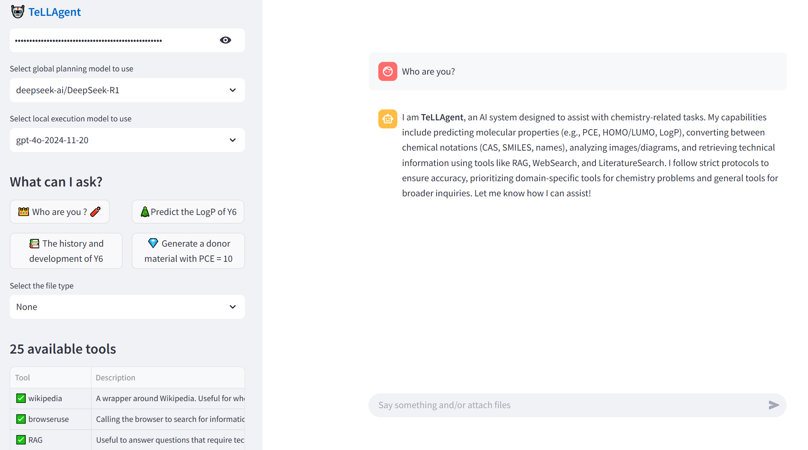

# 🤖**TeLLAgent**👑

### **<u>** A Two-Agent, Tool-Enhanced Large Language Model Framework for Autonomous Design and Discovery of Organic Materials**</u>**



## 😀Motivation

Large language models (LLMs) have advanced organic material discovery through natural language interfaces, cross-task generalization, and autonomous tool integration, enabling intuitive human-AI collaboration. However, their application remains constrained by limited multimodal synergy, restricted toolset, static knowledge bases, and insufficient multi-step reasoning capabilities. To address these challenges, we present TeLLAgent, a two-agent framework powered by **t**ool-**e**nhanced **l**arge **l**anguage models (LLMs), designed to autonomously orchestrate the end-to-end workflow of organic material design and discovery. The framework comprises a global planning agent (based on DeepSeek-R1) for query reasoning and sub-task specification, and a local execution agent (based on DeepSeek-V3) that precisely invokes domain-specific tools to accomplish complex tasks.

## 🛠Depends

We recommend to use [conda](https://conda.io/docs/user-guide/install/download.html) and [pip](https://pypi.org/project/pip/).

**By using the *requirements.txt* file, it will install all the required packages.**

```
git clone --depth=1 https://github.com/JinYSun/TeLLAgent.git
cd TeLLAgent
conda create --name tellagent python=3.11
conda activate tellagent
conda install pip
pip install -r requirements.txt
```


## 🎬Preparation

```
url1 = r"https://github.com/JinYSun/TeLLAgent/releases/download/V1.0.0/ppcenos.pt"
wget.download(url1,"tool/comget/ppcenos.pt")
url2 = r"https://github.com/JinYSun/TeLLAgent/releases/download/V1.0.0/test.ckpt"
wget.download(url2,"tool/dap/OSC/test.ckpt")
url3 = r"https://github.com/JinYSun/TeLLAgent/releases/download/V1.0.0/deepacceptor.pkl"
wget.download(url3,"tool/deepacceptor/deepacceptor.pkl")
url4 = r"https://github.com/JinYSun/TeLLAgent/releases/download/V1.0.0/sm.pkl"
wget.download(url4,"tool/deepdonor/sm.pkl")
url5 = r"https://github.com/JinYSun/TeLLAgent/releases/download/V1.0.0/pm.pkl"
wget.download(url5,"tool/deepdonor/pm.pkl")
url6 = r"https://github.com/JinYSun/TeLLAgent/releases/download/V1.0.0/homo.dat"
wget.download(url6,"tool/orbital/homo.dat")
url7 = r"https://github.com/JinYSun/TeLLAgent/releases/download/V1.0.0/lumo.dat"
wget.download(url7,"tool/orbital/lumo.dat")
```

Note❗❗： This package does not contain all the tools described in paper, some tools should be downloaded before using.

## 🔑Usage

```
from TeLLAgent import TeLLAgent
agent = TeLLAgent(model1="DeepSeek-R1",model2="DeepSeek-V3", temp=0.1, streaming=False,image_path ='...', file_path = '...')
agent.run("The history and development of Y6.")
```

[test.ipynb](https://github.com/JinYSun/BiBERTa/blob/branch/BiBERTa/test.ipynb):    contain the tutorials to show how to use the TeLLAgent.


## 🧐[HuggingFace](https://huggingface.co/spaces/jinysun/TeLLAgent)



***The TeLLAgent is available at HuggingFace. Some tools described in the paper are not availbale because of API usage restrictions.***

## 🪔Demo

The [example.ipynb](https://github.com/JinYSun/TeLLAgent/blob/master/Demo/example.ipynb) is used to show the usage of TeLLAgent. The files in Demo were used to test that the codes work well. 


## 📞Contact

Jinyu Sun. E-mail: [jinyusun@csu.edu.cn](mailto:jinyusun@csu.edu.cn)
