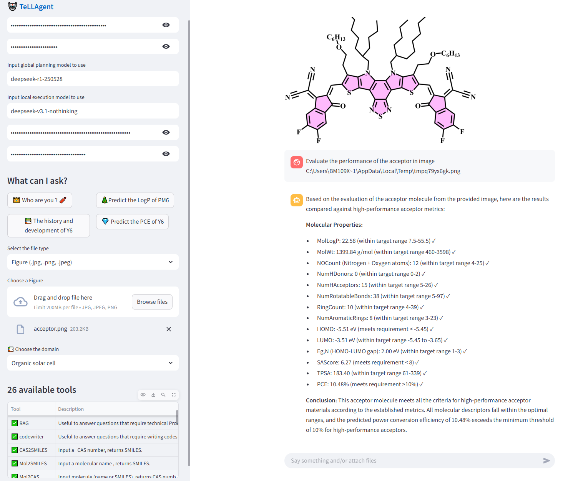

# 🤖**TeLLAgent**👑

------

### **<u>** TeLLAgent: A Tool-Enhanced Large Language Model-based Agent for Autonomous Design and Discovery of High-Performance Molecules</u>


## 😀Motivation

Large language model (LLM) agents have demonstrated significantly enhanced capabilities compared to individual LLMs. However, their application in the chemistry domain remains constrained by limited multimodal synergy, restricted toolsets, static knowledge bases, and insufficient multi-step reasoning and tool-calling capabilities. To address these challenges, we present TeLLAgent, a tool-enhanced and LLM-based agent framework designed to autonomously orchestrate the end-to-end workflow of high-performance molecule design and discovery. Its innovative dual-agent architecture, powered by open-source DeepSeek-R1 and DeepSeek-V3.1 models, features a global planning agent for strategic reasoning and a local execution agent for precise and tool-driven task completion. This design significantly improves the efficiency and accuracy of multi-step task execution. The development of the framework following the model context protocol (MCP) facilitates the integration of professionally sophisticated tools, delivering enhanced expertise and precision in field-specific applications. Combining with multi-source knowledge augmentation and a chain-of-thought strategy, TeLLAgent delivers unprecedented chemical accuracy and reliability. 

## 🛠Depends

We recommend to use [conda](https://conda.io/docs/user-guide/install/download.html) and [pip](https://pypi.org/project/pip/).

**By using the *requirements.txt* file, it will install all the required packages.**

```
git clone --depth=1 https://github.com/JinYSun/TeLLAgent.git
cd TeLLAgent
conda create --name tellagent python=3.11
conda activate tellagent
conda install pip
pip install -r requirements.txt
playwright install chromium
```

Two versions of TeLLAgent have been provided, one is based on [MCP](https://github.com/JinYSun/TeLLAgent/blob/main/TeLLAgent_mcp.py), the other is [without MCP](https://github.com/JinYSun/TeLLAgent/blob/main/TeLLAgent.py) (This framework differs slightly from the MCP format, but this does not affect its performance). 

## 🎬Preparation

Note❗❗： This package does not contain all the TRAINed tools described in paper, some tools should be downloaded before using.
TeLLAgent with mcp:
```
url1 = r"https://github.com/JinYSun/TeLLAgent/releases/download/V1.0.0/ppcenos.pt"
wget.download(url1,"tool/comget/ppcenos.pt")
url2 = r"https://github.com/JinYSun/TeLLAgent/releases/download/V1.0.0/test.ckpt"
wget.download(url2,"tool/dap/OSC/test.ckpt")
url3 = r"https://github.com/JinYSun/TeLLAgent/releases/download/V1.0.0/deepacceptor.pkl"
wget.download(url3,"tool/deepacceptor/deepacceptor.pkl")
url4 = r"https://github.com/JinYSun/TeLLAgent/releases/download/V1.0.0/sm.pkl"
wget.download(url4,"tool/deepdonor/sm.pkl")
url5 = r"https://github.com/JinYSun/TeLLAgent/releases/download/V1.0.0/pm.pkl"
wget.download(url5,"tool/deepdonor/pm.pkl")
url6 = r"https://github.com/JinYSun/TeLLAgent/releases/download/V1.0.0/homo.dat"
wget.download(url6,"tool/orbital/homo.dat")
url7 = r"https://github.com/JinYSun/TeLLAgent/releases/download/V1.0.0/lumo.dat"
wget.download(url7,"tool/orbital/lumo.dat")
url8 = r"https://github.com/JinYSun/TeLLAgent/releases/download/V1.0.0/index.pkl"
wget.download(url8,"tool/rag/index.pkl")
url9 = r"https://github.com/JinYSun/TeLLAgent/releases/download/V1.0.0/index.faiss"
wget.download(url9,"tool/rag/index.faiss")
```
TeLLAgent without mcp:

```
url1 = r"https://github.com/JinYSun/TeLLAgent/releases/download/V1.0.0/ppcenos.pt"
wget.download(url1,"tool_withoutmcp/comget/ppcenos.pt")
url2 = r"https://github.com/JinYSun/TeLLAgent/releases/download/V1.0.0/test.ckpt"
wget.download(url2,"tool_withoutmcp/dap/OSC/test.ckpt")
url3 = r"https://github.com/JinYSun/TeLLAgent/releases/download/V1.0.0/deepacceptor.pkl"
wget.download(url3,"tool_withoutmcp/deepacceptor/deepacceptor.pkl")
url4 = r"https://github.com/JinYSun/TeLLAgent/releases/download/V1.0.0/sm.pkl"
wget.download(url4,"tool_withoutmcp/deepdonor/sm.pkl")
url5 = r"https://github.com/JinYSun/TeLLAgent/releases/download/V1.0.0/pm.pkl"
wget.download(url5,"tool_withoutmcp/deepdonor/pm.pkl")
url6 = r"https://github.com/JinYSun/TeLLAgent/releases/download/V1.0.0/homo.dat"
wget.download(url6,"tool_withoutmcp/orbital/homo.dat")
url7 = r"https://github.com/JinYSun/TeLLAgent/releases/download/V1.0.0/lumo.dat"
wget.download(url7,"tool_withoutmcp/orbital/lumo.dat")
url8 = r"https://github.com/JinYSun/TeLLAgent/releases/download/V1.0.0/index.pkl"
wget.download(url8,"tool_withoutmcp/rag/index.pkl")
url9 = r"https://github.com/JinYSun/TeLLAgent/releases/download/V1.0.0/index.faiss"
wget.download(url9,"tool_withoutmcp/rag/index.faiss")
```


## 🔑Usage

First set up your API keys in your environment.

```
export OPENAI_API_KEY=your-openai-api-key
export SERP_API_KEY=your-serpapi-api-key[option]
```

or set api_keys in [txt](https://github.com/JinYSun/TeLLAgent/blob/main/api.txt) and [server](https://github.com/JinYSun/TeLLAgent/blob/main/tool/api.txt)

```
SERP_API_KEY =   '******'
OPENAI_API_KEY = 'sk-********'
CHEMSPACE_API_KEY =  None
SEMANTIC_SCHOLAR_API_KEY = '******'
OPENAI_API_BASE = None
```
The TeLLAgent_withoutmcp is built to run in an interactive environment like Jupyter Notebook or PyCharm. It's perfect for data exploration, rapid prototyping, and development, as it allows you to run and debug your code in a more user-friendly setting.
```
from TeLLAgent import TeLLAgent
agent = TeLLAgent(
        temp=0.1, 
        streaming=True,
        model1="deepseek-r1-250528",
        model2="deepseek-v3.1-nothinking", 
        openai_api_key=os.getenv("OPENAI_API_KEY"), 
        max_iterations=50,
        verbose=True,
        image_path=r"...",
        file_path=r" "
    )

result1, reasoning_trace1 = agent.run("Predict the PCE of Y6")
print(result1['final_answer'])    
```
MCP version is designed to be run directly from your terminal. It's must be used in command-line interface.
```
python TeLLAgent_mcp.py  
```


[test.ipynb](https://github.com/JinYSun/BiBERTa/blob/branch/BiBERTa/test.ipynb):    contain the tutorials to show how to use the TeLLAgent.


## 🧐[HuggingFace](https://huggingface.co/spaces/jinysun/TeLLAgent)



***The TeLLAgent is available at HuggingFace. Some tools described in the paper are not availbale because of API usage restrictions.***

It will take some time, since it is running on a cpu.


## 📞Contact

Jinyu Sun. E-mail: [jinyusun@csu.edu.cn](mailto:jinyusun@csu.edu.cn)
